<h1 align="center"> NLW Copa </h1>

Evento exclusivo e gratuito, promovido pela Rocketseat para ensino de tecnologias WEB.

  <a href="#🚀-tecnologias">Tecnologias</a>&nbsp;&nbsp;&nbsp;|&nbsp;&nbsp;&nbsp;
  <a href="#💻-projeto">Projeto</a>&nbsp;&nbsp;&nbsp;|&nbsp;&nbsp;&nbsp;
  <a href="#🔖-layout">Layout</a>&nbsp;&nbsp;&nbsp;|&nbsp;&nbsp;&nbsp;
  <a href="#🖼-screenshot-web">Layout</a>&nbsp;&nbsp;&nbsp;|&nbsp;&nbsp;&nbsp;
  <a href="#📝-licença">Licença</a>

  

 

  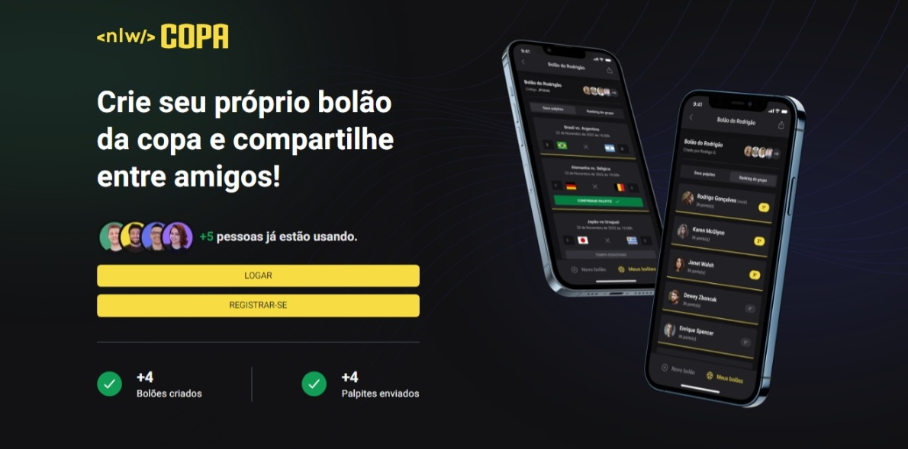

  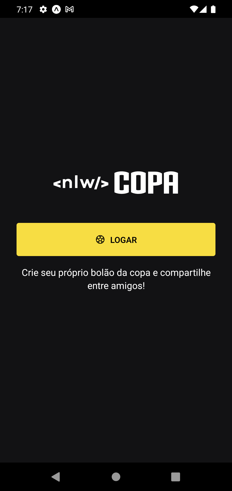
  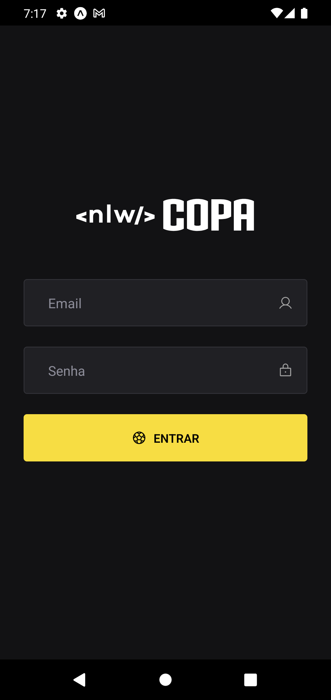
  
  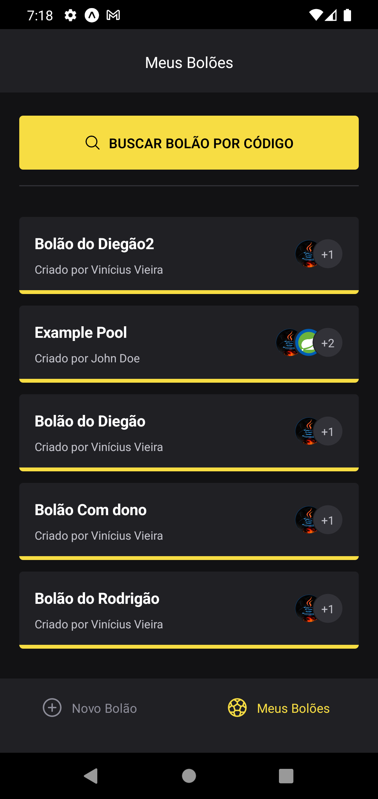
  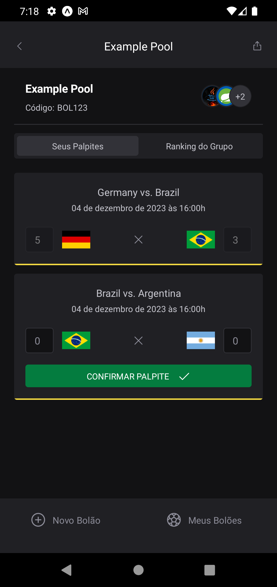

## 🚀 Tecnologias

Esse projeto foi desenvolvido com as seguintes tecnologias:

- Front
  - NextJS
  - Tailwind
  - Typescript
  - Lucide-react
  - Shadcn UI
- Back
  - Java 17
  - Spring Boot Framework
  - Spring Security
  - Spring Validation
  - MySQL
  - Model Mapper
  - Flyway
  - JsonWebToken
- Mobile
  - React Native
  - Typescript
  - Phosphor React
  - Gluestack UI
  - country-list
  - react-native-country-flag
  - dayjs

## 💻 Projeto

O Nlw Copa é uma aplicação web e mobile com o objetivo de criar bolões de apostas para você se divertir com os amigos durante a copa do mundo que está vindo por ai.

Projeto paralizado, preciso aprender ionic para a parte mobile.

## 🔖 Layout

Você pode visualizar o layout do projeto através [DESSE LINK](https://www.figma.com/file/pgWxlBr4x2U9mlnyCGWapK/Bolão-da-Copa-(Community)?node-id=0%3A1). É necessário ter conta no [Figma](https://figma.com) para acessá-lo.

## 🖼 ScreenShot Web

  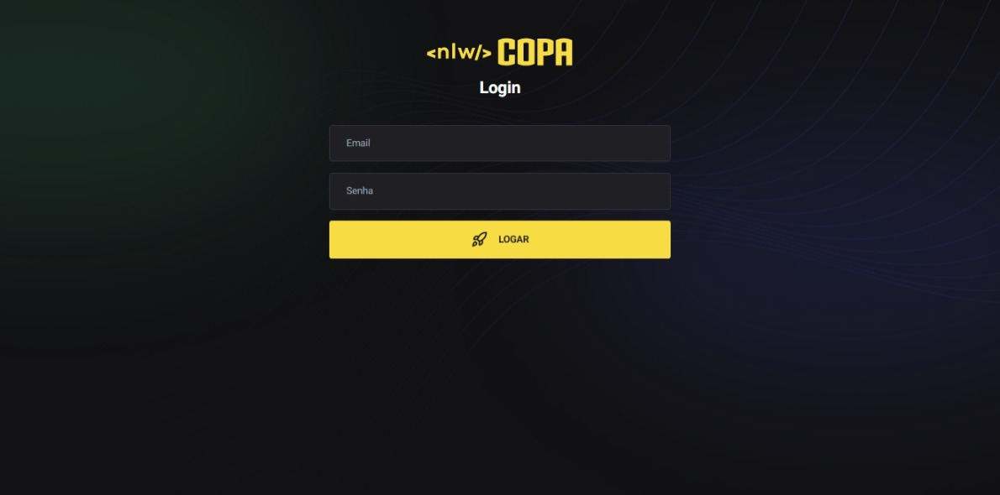
  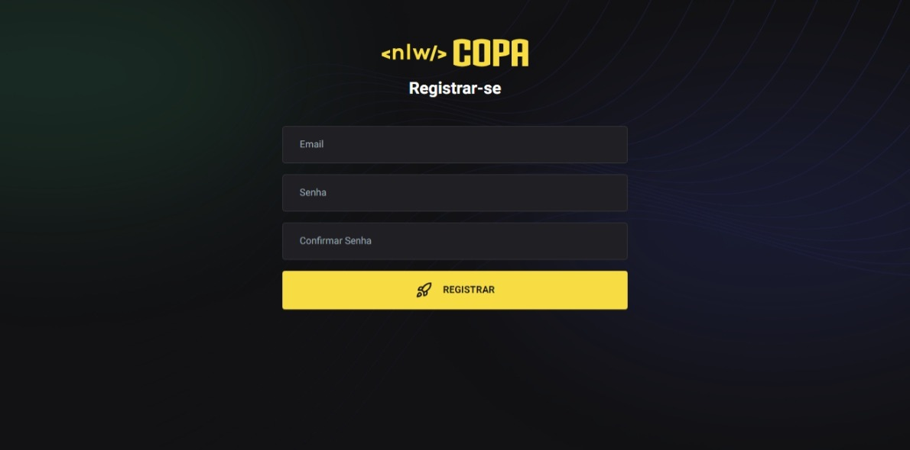
  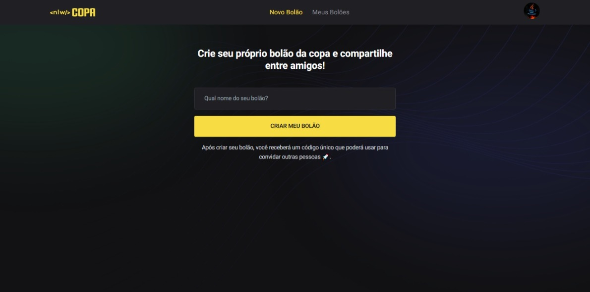
  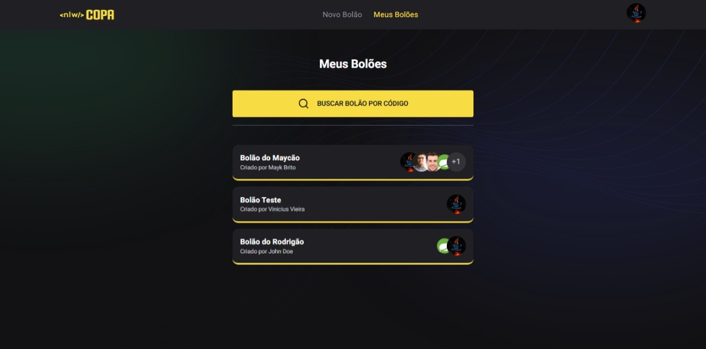
  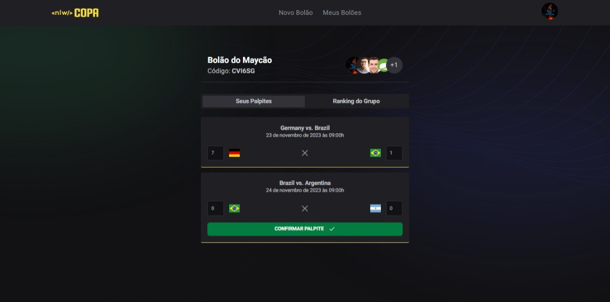
  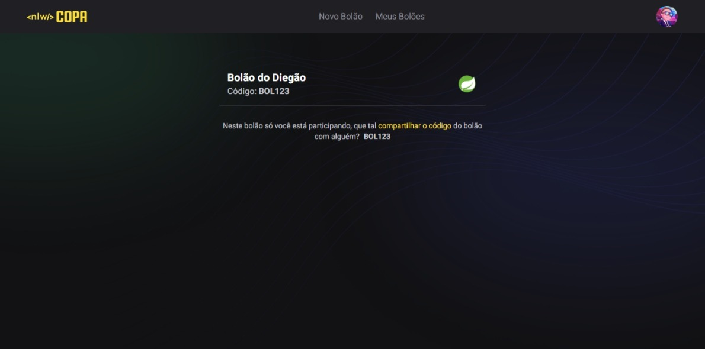
  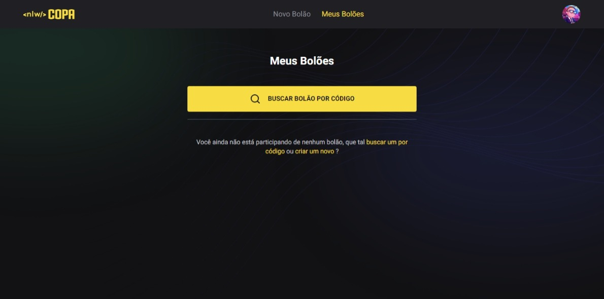

## 📝 Licença

Esse projeto está sob a licença MIT.

---

Feito com ♥ by Rocketseat :wave: [Participe da nossa comunidade!](https://discord.gg/rocketseat)
